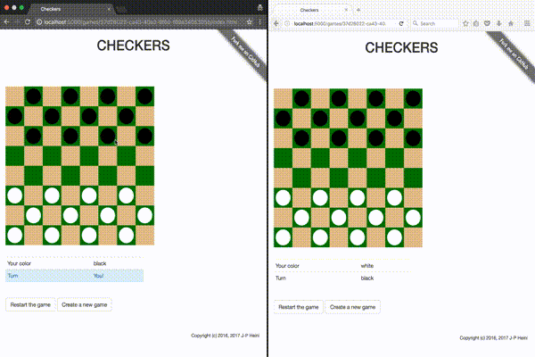

# Checkers game in Clojure & ClojureScript

This is a simple checkers board game, written in Clojure and ClojureScript.

The game follows the rules of American checkers (also known as English draughts or Straight checkers). Check out the [rules](https://en.wikipedia.org/wiki/English_draughts) in Wikipedia. Every rule except game ending in a draw is implemented.

## How does it look like?

You can try the game out in [Heroku](https://clj-checkers.herokuapp.com/).

When you open the link above in a browser, you will be redirected to a page with long URL that identifies the game instance.

Ideally, you would share this URL with your friend to play a match against him. But if you want to try the game out yourself, you can also point a second browser to the URL (i.e. use a different browser session):



## Implementation

Thanks goes out to Mark Bastian for his inspirational [talk](https://www.youtube.com/watch?v=Tb823aqgX_0) and accompanying [code](https://github.com/markbastian/pirates) on how to write rules for turn-based games using a "bottom up" approach!

### server.clj

The state of the game is contained server-side and broadcasted to clients using [Sente](https://github.com/ptaoussanis/sente) WebSocket library.

[HTTP kit](http://www.http-kit.org/) webserver is used to serve the compiled ClojureScript frontend code to the clients.

Routing is handled with [Compojure](https://github.com/weavejester/compojure). As the game lacks a dedicated "game lobby", creating new games and joining to existing ones is based on routing.

Browser sessions are used to identify the players (e.g. if user refreshes the page in browser).

### client.cljs

The frontend is built with [Reagent](https://reagent-project.github.io/) and [Bootstrap](http://getbootstrap.com/css/).

[Sente](https://github.com/ptaoussanis/sente) is used for improved WebSocket support: client sends every move to the server for verification, and, in case of success, server broadcasts the new state back to both players.

Drag and drop is based on HTML5 drag and drop standard, with some help from Clojure's excellent core.async library.

### rules.cljc

Game logic is implemented as pure functions (plus some constants) that generate and manipulate game state, a persistent Clojure data structure. These pure functions are used by both the server-side and the client-side code, although client-side code uses only few of the functions as helpers to render the game UI.

### Tests

There are unit tests for the basic rules of the game. Tests make use of [PDN FEN tags](http://pdn.fmjd.org/fen.html) to succinctly describe an initial position on the board. Library called [instaparse](https://github.com/Engelberg/instaparse) is used to parse FEN tags into parse tree, which is then transformed into a game state understood by the rules module.

## Running the game locally

First start the server with Boot or Docker, then join into the game using a web browser.

### Starting the server with Boot

First ensure you have a recent version of Java and Boot installed.

The following Boot task will compile the code and start the server:

```sh
$ boot dev
```

### Starting the server with Docker

First ensure you have Docker installed and running.

Change into the source code directory and compile the code by executing the following command:

```sh
$ docker run -it --rm -v $(pwd):/app -w /app siili/boot-clj sh -c 'boot build'
```

(This will take some time, but the next command should be fast!)

After compilation has finished, the following command will launch the game server:

```sh
$ docker run -it --rm -p 127.0.0.1:5000:5000 -v $(pwd):/app -w /app siili/boot-clj sh -c 'java $JAVA_OPTS -cp target/app.jar clojure.main -m checkers.server'
```

### Starting the frontend and playing the game

With the server running, point your browser to [http://localhost:5000](http://localhost:5000). This will connect you to the game as the black player. Make note of the URL in the browser after you connect to the game: the URL identifies the game instance and can be used to join back to it, provided you don't close the browser and therefore lose the browser session.

Launch a second browser instance (or a different browser altogether) and navigate to the URL you were redirected to in the previous step. This will connect you to the game as the white player. You can of course also share this URL with your friend to play against him, provided he can reach your local server.

## License

Copyright (c) 2016, 2017 J-P Heini

Distributed under GNU Affero General Public License
